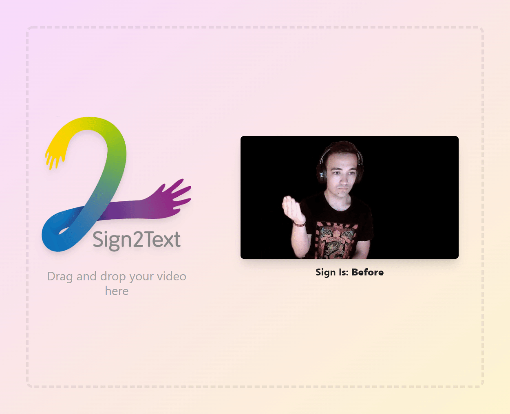

# Sign2Text

<table align="center"><tr><td align="center" width="9999">

 

 
 

Transcripción de lenguaje de signos (a nivel de palabra) mediante Deep Learning
</td></tr></table>

---

## How it looks

---

## How to start

`npm i`

`npm run dev`

## Create production build

`npm run build`

`npm run start`
